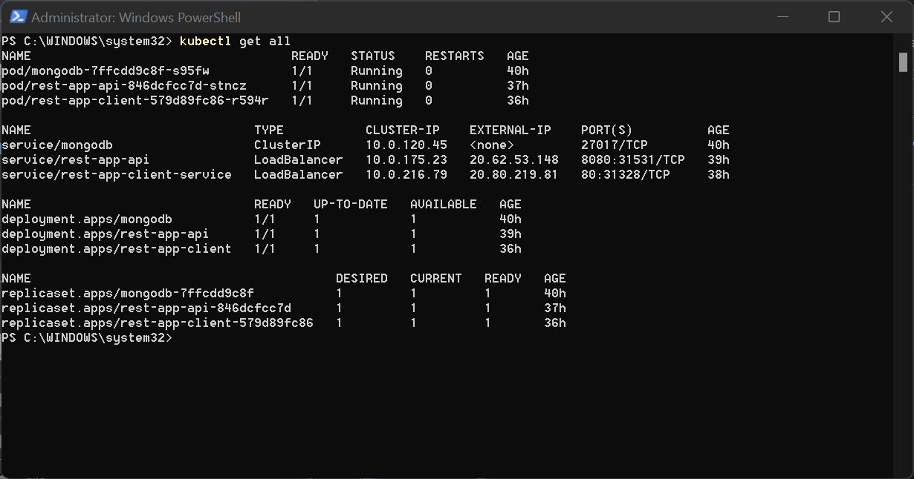

# Microservice-Project-Task3
- [x] Build docker images.   
  Following docker images have been created and pushed to docker hub :
  - [REST API ( Task 1 )](https://hub.docker.com/r/mdshariq614/rest-app-api)
  - [React App ( Task 4 )](https://hub.docker.com/r/mdshariq614/rest-app-client)
- [x] Deploy to the cluster by applying your manifests.   
  Following manifestation files have been created and applied :
  - [db-persistence.yaml](db-persistence.yaml) :  Creates a persistent volume that will be used to store the MongoDB data.
  - [db-deployment.yaml](db-deployment.yaml) : Creates MongoDB deployment.
  - [db-service.yaml](db-service.yaml) : Creates service for MongoDB pod.
  - [app-deployment.yaml](app-deployment.yaml) : Creates a deployment for REST API and environment variable for MongoDB connection.
  - [app-service.yaml](app-service.yaml) : Creates a LoadBalancer service to expose REST API at port 8080. 
  - [client-deployment.yaml](client-deployment.yaml) : Creates a deployment for React App.
  - [client-service.yaml](client-service.yaml): Creates a LoadBalancer service to expose React App at port 80.     
     
     
       
         
         
       
- [X] Application should be accessable from local machine.  
  
    
    
    
  
